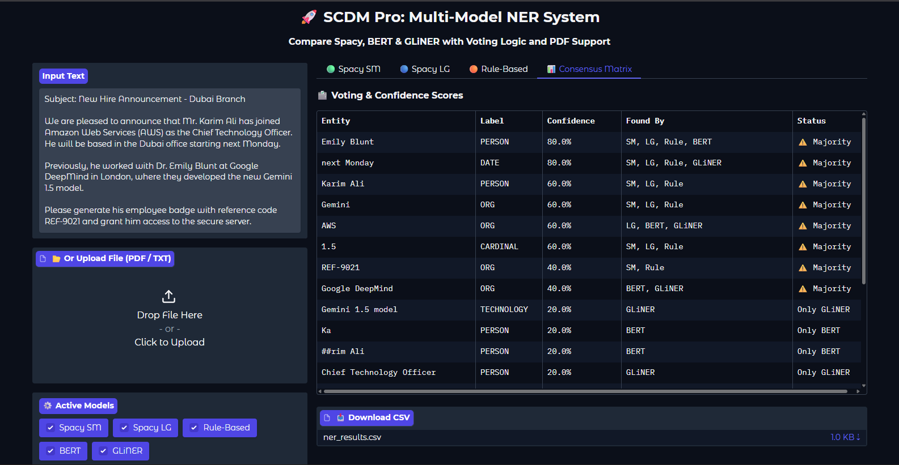

# 

# SCDM Pro: Semantic Convergence & Discrepancy Matrix
### Advanced Multi-Model Named Entity Recognition (NER) System


**SCDM Pro** is a high-precision entity extraction framework designed to solve the common pitfalls of single-model NLP systems. By utilizing a **Semantic Convergence** approach, it aggregates predictions from **5 distinct AI architectures** to form a consensus, ensuring that data extraction is accurate, robust, and verifiable.

---

## Why SCDM Pro? (The Problem & Solution)

Standard NER models often fail when facing:
1.  **Ambiguity:** Is "Jordan" a country or a person?
2.  **New Terminology:** New tech stacks (e.g., "LangChain", "GPT-4") are often missed by older models.
3.  **Complex Formats:** PDF text extraction often breaks names and sentences (e.g., "Ah- med").

**The Solution:** Instead of relying on one "brain," SCDM Pro uses a **Weighted Voting Mechanism** involving:
* **Statistical Models:** Spacy Small & Large.
* **Transformer Models:** BERT (Deep Context).
* **Zero-Shot Models:** GLiNER (For new/unseen labels).
* **Rule-Based Logic:** Regex and Patterns (For IDs and specific roles).

---

## Key Features

### 1. The Ensemble Engine
The system runs the following models in parallel on the same text:
* **Spacy SM & LG:** Fast, efficient syntactic analysis.
* **BERT Transformer (dslim/bert-base-NER):** State-of-the-art context understanding for standard entities.
* **GLiNER (urchade/gliner_medium-v2.1):** A Zero-Shot model capable of detecting arbitrary labels like `drug`, `symptom`, or `software` without specific training.
* **EntityRuler:** A custom rule-engine that forces detection of specific patterns (IDs, Job Titles).

### 2. Intelligent Voting & Consensus
The system doesn't just list entities; it **votes** on them:
* **Full Consensus:** All active models agree on the entity and label.
* **Majority:** Most models agree, but there is some discrepancy.
* **Disagreement:** Only one model found the entity (flagged for review).

### 3. Robust File Parsing
* **PDF Support:** Uses `PyMuPDF` (fitz) to extract text from PDF documents.
* **Text Cleaning:** Automatically fixes broken lines and whitespace issues common in PDF extraction before feeding data to the models.

---

## Technical Architecture

The pipeline processes data through the following stages:

1.  **Input Layer:** Accepts Raw Text or PDF Files.
2.  **Preprocessing:** Text normalization and cleaning.
3.  **Model Inference Layer:**
    * *Rules:* Regex for IDs (e.g., `REF-\d{4}`), Academic Titles (`Dr.`, `Prof.`).
    * *Transformers:* Mapping BERT labels (`PER`, `LOC`) to Spacy standard (`PERSON`, `GPE`) for comparison.
    * *Zero-Shot:* Prompting GLiNER for specific custom labels.
4.  **Convergence Layer:**
    * Aggregates all findings.
    * Calculates **Confidence Score** based on model agreement.
    * Deduplicates overlapping entities.
5.  **Output Layer:** Renders the Gradio Interface and generates CSV reports.

---

## Installation & Setup

### 1. Clone the Repository
```bash
git clone [https://github.com/your-username/SCDM-Pro.git](https://github.com/your-username/SCDM-Pro.git)
cd SCDM-Pro

```

### 2. Install Dependencies

```bash
pip install -r requirements.txt

```

### 3. Download Spacy Models

You must download the language models before running the app:

```bash
python -m spacy download en_core_web_sm
python -m spacy download en_core_web_lg
python -m spacy download en_core_web_trf

```

---

## Code Implementation

### 1. Running the GUI

To start the Gradio interface, simply run the main application script:

```python
# src/app.py
import gradio as gr
from logic import process_pipeline

# Launch the interface
if __name__ == "__main__":
    demo.launch(share=True)

```

### 2. Using the Logic Programmatically

You can use the core logic without the GUI to process text in your own scripts:

```python
from models import load_models
from logic import run_voting_system

# 1. Load Models (Simulated)
nlp_trf, bert_pipe, gliner_model = load_models()

# 2. Input Text
text = "Dr. Ahmed accepted the offer from OpenAI in San Francisco."

# 3. Run Voting Logic
results = run_voting_system(text, nlp_trf, bert_pipe, gliner_model)

# 4. View Results
for entity in results:
    print(f"Entity: {entity['text']} | Label: {entity['label']} | Confidence: {entity['score']}%")
# Output:
# Entity: Ahmed | Label: PERSON | Confidence: 100% (Consensus)
# Entity: OpenAI | Label: ORG | Confidence: 100% (Consensus)

```

### 3. Adding Custom Rules (Regex)

To detect custom patterns like Employee IDs or Invoice Numbers, you can modify the `EntityRuler` configuration in `models.py`:

```python
# Adding a regex pattern for Invoice Numbers (e.g., INV-2024)
patterns = [
    {"label": "INVOICE_ID", "pattern": [{"TEXT": {"REGEX": "^INV-\d{4}$"}}]},
    {"label": "ROLE", "pattern": [{"LOWER": "senior"}, {"LOWER": "engineer"}]}
]
ruler.add_patterns(patterns)

```

---

## Project Structure

```text
SCDM-Pro/
│
├── data/                      # Directory for sample PDF/TXT files
│   ├── sample_resume.pdf
│   └── test_data.txt
│
├── output/                    # Directory where CSV results are saved
│   └── ner_results.csv
│
├── src/                       # Source Code
│   ├── __init__.py
│   ├── app.py                 # Main entry point (Gradio Launcher)
│   ├── models.py              # Model loading (BERT, GLiNER, Spacy)
│   ├── logic.py               # Voting mechanism & Consensus logic
│   └── utils.py               # File reading (PDF) & Text cleaning
│
├── .gitignore
├── requirements.txt           # Python dependencies
├── README.md                  # Project Documentation
└── final_evo.png              # Project Architecture Diagram/Logo

```

---

## License

This project is open-source and available under the MIT License.


## Test Case Example

**Input Text:**

> "Dr. Ahmed Fahim, the Senior Engineer at OpenAI, met with Mohamed Salah in Cairo. The employee ID is REF-9021."

**Expected Result:**

* **Ahmed Fahim:** Detected as `PERSON` (Consensus: High).
* **OpenAI:** Detected as `ORG` (Consensus: High).
* **Cairo:** Detected as `GPE` (Consensus: High).
* **Senior Engineer:** Detected as `ROLE` (Captured by Rule-Based logic).
* **REF-9021:** Detected as `ID_CODE` (Captured by Regex).

---
